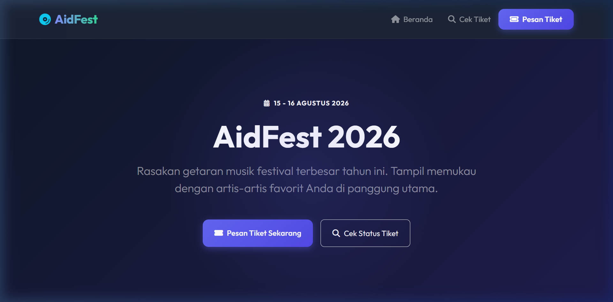
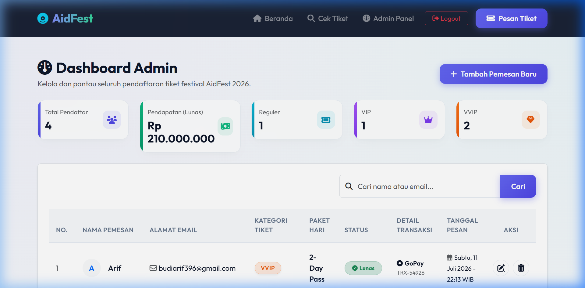
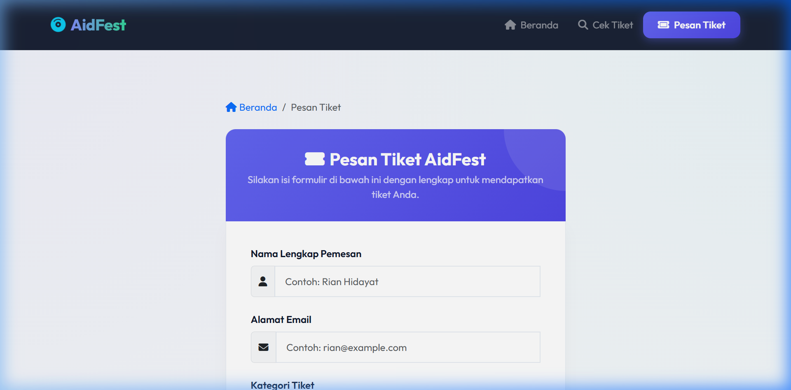

# LAPORAN TUGAS UAS PEMROGRAMAN WEB
## Judul Website: AidFest 2026 – Music Festival Ticket Management

<br>

**Dosen Pengampu Mata Kuliah Pemrograman Web:**  
**Budi Sulistiyo Jati. S.Kom, M.Eng**

<br>

<div align="center">

```
======================================================
           UNIVERSITAS MERCU BUANA YOGYAKARTA
======================================================
```

<!-- [LOGO UNIVERSITAS] -->

<br><br>

**Di Susun Oleh:**

**Nama:** M Arif Budi Prakoso 
**NIM:** 241110103

<br><br>

**FAKULTAS TEKNOLOGI INFORMASI UNIVERSITAS**  
**MERCU BUANA YOGYAKARTA 2026/2027**

</div>

---
---

## 1. Pendahuluan

### Latar Belakang
Perkembangan teknologi informasi mendorong industri kreatif, khususnya penyelenggaraan acara festival musik, untuk memanfaatkan aplikasi digital dalam mengelola aktivitas pendaftaran dan penjualan tiket. Namun, masih banyak penyelenggara festival lokal yang kesulitan mengelola data transaksi pendaftaran secara transparan, menghitung pendapatan riil secara dinamis, dan mencegah pemalsuan tiket fisik. Kondisi tersebut dapat menyebabkan kesalahan pendataan penonton, kebocoran dana, serta lambatnya pelayanan pencetakan tiket.

Untuk mengatasi permasalahan tersebut, dikembangkan **AidFest 2026 – Music Festival Ticket Management**, yaitu aplikasi berbasis web yang membantu calon penonton melakukan pemesanan tiket, memilih kategori secara interaktif, menyelesaikan simulasi pembayaran, serta mengunduh E-ticket virtual secara instan. Selain itu, aplikasi ini menyediakan panel administrasi modern untuk mengontrol alur data pendaftaran (CRUD), menghitung pendapatan dinamis dari pesanan berstatus lunas, serta didukung pengiriman email tiket secara asinkron untuk kenyamanan pengguna.

AidFest 2026 dirancang menggunakan konsep pemrograman **Native PHP** dengan proteksi database berbasis **PDO (PHP Data Objects)** untuk melindungi data dari celah keamanan *SQL Injection*. Dengan adanya aplikasi ini, diharapkan calon pengunjung dapat memesan tiket dengan mudah dan aman, serta administrator dapat mengelola data transaksi festival secara lebih efektif, terorganisir, dan produktif.

### Rumusan Masalah
1. Bagaimana merancang dan membangun aplikasi **AidFest 2026 – Music Festival Ticket Management** berbasis Native PHP yang dapat membantu pengguna melakukan pemesanan tiket festival secara online?
2. Bagaimana menyediakan fitur pendaftaran tiket, simulasi invoice pembayaran, dan pencetakan E-Ticket virtual dalam satu platform yang terintegrasi?
3. Bagaimana menerapkan sistem perhitungan metrik pendapatan bersih secara real-time pada panel admin berdasarkan data transaksi yang berstatus lunas?
4. Bagaimana menerapkan sistem keamanan (autentikasi admin) dan optimalisasi pengiriman email asinkron di background agar halaman web tetap responsif?

### Tujuan
1. Merancang dan membangun aplikasi **AidFest 2026 – Music Festival Ticket Management** berbasis Native PHP untuk mempermudah calon penonton dalam memesan tiket konser.
2. Menyediakan fitur pemesanan tiket, mockup gerbang pembayaran, dan pencetakan E-Ticket PDF secara instan guna meningkatkan kepuasan pengguna.
3. Menerapkan dashboard panel admin dengan kalkulasi statistik pendaftar dan total pendapatan bersih dinamis dari database.
4. Menerapkan autentikasi keamanan bagi admin (login tersembunyi) serta pengiriman email tiket di background (*asynchronous background job*) untuk kecepatan performa web.

---

## 2. Pembahasan Teknologi yang digunakan dan Fitur-fitur

Aplikasi website **AidFest 2026 – Music Festival Ticket Management** ini dirancang dengan arsitektur modern berbasis PHP Native dan Javascript. Berikut adalah rincian teknologi yang digunakan dalam pengembangannya:

| Teknologi yang digunakan | Penjelasan |
| :--- | :--- |
| **PHP (Versi 8.2+)** | Bahasa pemrograman utama sisi server (*server side*) yang mengendalikan semua pemrosesan data backend. |
| **Native PHP & PDO Connection** | Konektivitas database menggunakan *PHP Data Objects* (PDO) dengan *Prepared Statements* untuk mencegah celah keamanan *SQL Injection*. |
| **Database (MySQL / PostgreSQL)** | Untuk penyimpanan data terstruktur (tabel admin untuk login, tabel pendaftaran_tiket untuk transaksi penonton). |
| **Bootstrap 5** | Framework CSS yang digunakan sebagai kerangka utama penyusunan layout (Grid system, Container, Form controls, Navbar, Footer) yang responsif. |
| **Vanilla CSS (Custom Styling)** | CSS kustom tambahan untuk mewujudkan tema estetika visual premium dengan gradasi warna modern dan efek *glassmorphism*. |
| **Vanilla JS (Custom Interactive Logic)** | Logika JavaScript untuk validasi form real-time, efek transisi visual, shortcut akses login admin, dan sinkronisasi harian kategori VVIP. |
| **PHPMailer** | Library eksternal untuk menangani pengiriman E-Ticket ke email pengguna dengan menggunakan SMTP server. |
| **html2pdf.js** | Pustaka client-side JavaScript untuk mengubah dokumen E-Ticket HTML menjadi format PDF siap cetak/unduh secara otomatis. |
| **FontAwesome 6** | Koleksi ikon vektor SVG yang digunakan pada ikon navigasi, status pembayaran, dan detail layout tiket. |
| **Outfit (Google Fonts)** | Tipografi modern yang digunakan untuk seluruh teks pada aplikasi web agar terlihat sangat elegan dan premium. |

---

### Tampilan Landing Page:
Halaman depan (Landing Page) dirancang dengan tema premium yang memukau calon pembeli. Menampilkan informasi lineup artis global, daftar tarif harga tiket terbaru yang diatur secara terpusat (*Single Source of Truth*), tombol pemesanan langsung, serta menu pencarian tiket yang memudahkan calon penonton menemukan data E-ticket mereka.


*Gambar 2.1: Halaman Beranda (Landing Page) AidFest 2026*

---

### Login Administrator:
Fitur Login Administrator digunakan sebagai proses autentikasi pengelola sebelum mengakses panel dashboard. Untuk alasan keamanan, tombol masuk halaman login ini disembunyikan dari navigasi utama. Admin dapat mengaksesnya secara rahasia dengan melakukan klik dua kali (*double-click*) pada teks logo "AidFest" di footer atau menekan kombinasi tombol `Ctrl + Shift + A` di keyboard.

*(Masukkan gambar screenshot halaman login admin di sini)*

---

### Dashboard Admin (Statistik & CRUD):
Panel admin menampilkan ringkasan data yang dihitung secara dinamis dari database (Total Tiket, Total Pendapatan Bersih dari status Lunas), tabel data pengunjung lengkap dengan tombol pencarian instan, aksi untuk menyunting status pembayaran pelanggan (Update), dan menghapus data pendaftaran tiket (Delete).


*Gambar 2.2: Tampilan Dashboard Utama Panel Admin (CRUD)*

---

### Formulir Pemesanan Tiket (Create):
Formulir pendaftaran tiket dilengkapi dengan validasi real-time di frontend. Di halaman pemesanan ini terdapat logika sinkronisasi form khusus kategori VVIP: jika kategori **VVIP** dipilih oleh calon pembeli, JavaScript secara otomatis menonaktifkan pilihan harian (Day 1 / Day 2) dan mengunci pilihan ke **2-Day Pass** demi mencegah kesalahan input data.


*Gambar 2.3: Formulir Pendaftaran Pemesanan Tiket*

---

### Simulasi Pembayaran (Checkout):
Halaman pembayaran dirancang mirip dengan alur transaksi asli, lengkap dengan timer hitung mundur 10 menit, nomor Virtual Account dengan tombol salin, dan QRIS QR Code. Setelah pembayaran sukses disimulasikan, pengguna dapat langsung dialihkan secara instan ke tiket virtual miliknya.

*(Masukkan gambar screenshot simulasi pembayaran di sini)*

---

### Cetak E-Ticket PDF:
Pengguna dapat langsung mengunduh tiket virtualnya dalam format file PDF berukuran A5 dengan mengklik tombol **"Unduh E-Ticket (PDF)"** yang didukung pustaka `html2pdf.js`. Konversi HTML ke PDF dilakukan secara client-side sehingga tidak membebani pemrosesan di sisi server.

*(Masukkan gambar screenshot tampilan E-Ticket virtual di sini)*

---

### Pengiriman Email Tiket Asinkron:
Setelah transaksi berstatus *Lunas*, browser akan mengalihkan pengguna ke halaman E-Ticket secara cepat. Pemanggilan file `send_email_async.php` dijalankan di background menggunakan metode `fetch()` JavaScript sehingga proses pengiriman email SMTP tidak memicu loading lama pada web.

---

### Database Supabase (PostgreSQL / MySQL):
Skema basis data terdiri dari tabel `admin` untuk manajemen akun pengelola, serta tabel `pendaftaran_tiket` untuk menyimpan data transaksi, status pembayaran, dan metode pembayaran. Konfigurasi file database menggunakan PDO PHP yang secara otomatis menjalankan migrasi dan auto-seeding jika tabel belum terbentuk.

---

## 3. Kesimpulan

**AidFest 2026 – Music Festival Ticket Management** merupakan aplikasi berbasis web yang dikembangkan menggunakan **Native PHP** dan **PDO** untuk memfasilitasi manajemen pendaftaran dan penjualan tiket festival musik secara online. Melalui fitur seperti pendaftaran tiket responsif, dashboard statistik admin yang kalkulatif secara real-time, mockup gerbang pembayaran dengan simulasi status bayar, hingga pencetakan E-Ticket virtual ke dalam format PDF dan pengiriman email asinkron di background, aplikasi ini berhasil menyajikan solusi operasional yang efisien dan aman.

Dengan adanya sistem ini, proses pengelolaan pendaftaran tiket menjadi lebih terorganisir, risiko kebocoran dana dapat dikurangi dengan validasi status lunas, serta performa kecepatan muat halaman web tetap terjaga dengan baik.

---

* **Link video presentasi:** [https://drive.google.com/drive/folders/1ELc31ojtFNZJPyLjJZ4G_mD7oBz6sPBi?usp=sharing](https://drive.google.com/drive/folders/1ELc31ojtFNZJPyLjJZ4G_mD7oBz6sPBi?usp=sharing)
* **Link Website AidFest 2026:** [https://aidfest2026.up.railway.app](https://aidfest2026.up.railway.app)
* **Link GitHub:** [https://github.com/Afrizamv/Webkali](https://github.com/Afrizamv/Webkali)
